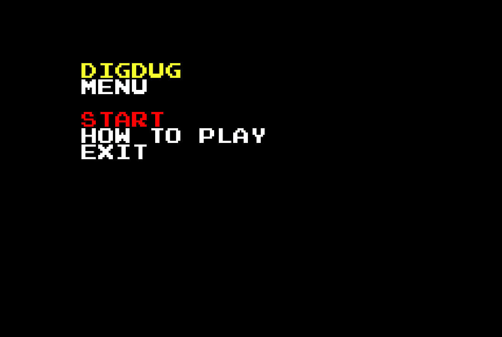
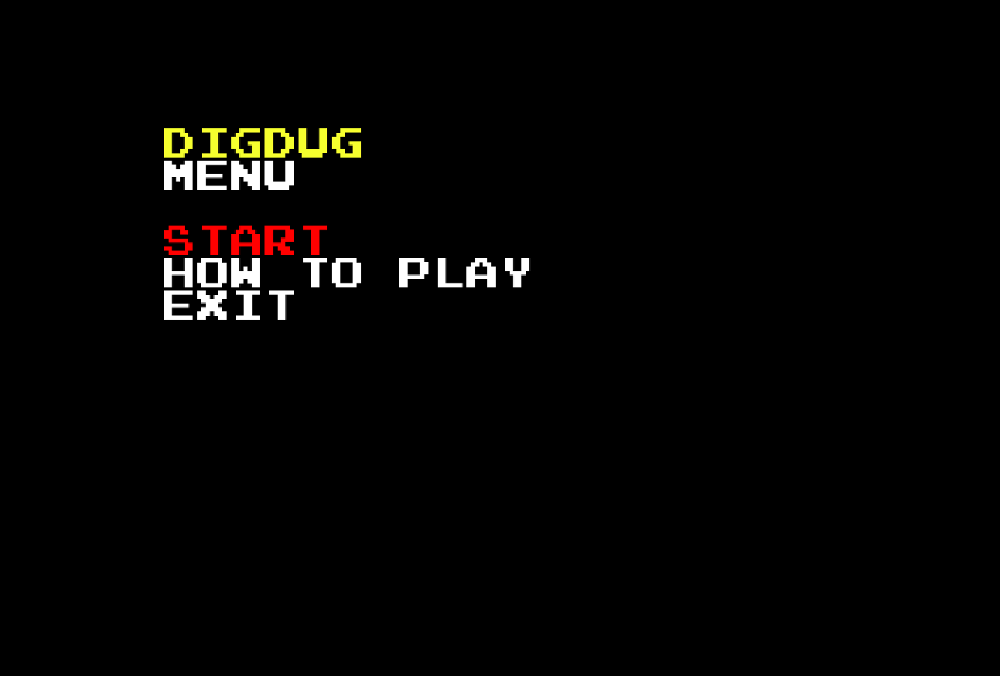
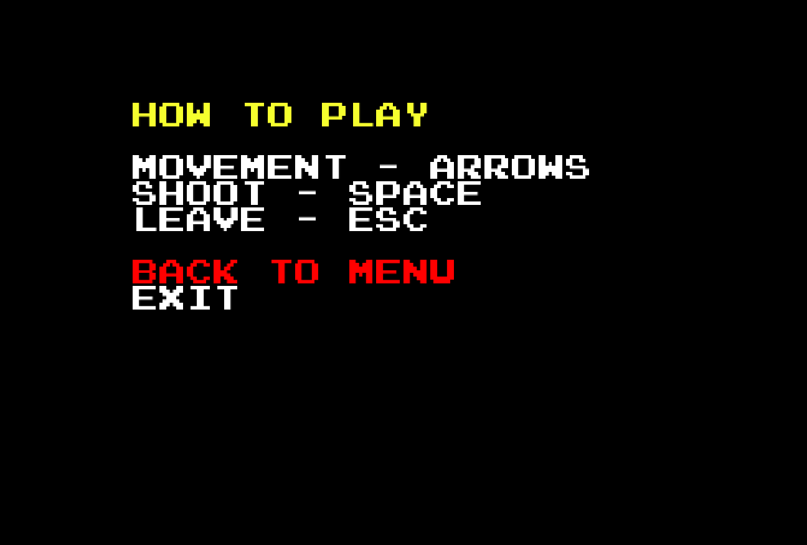
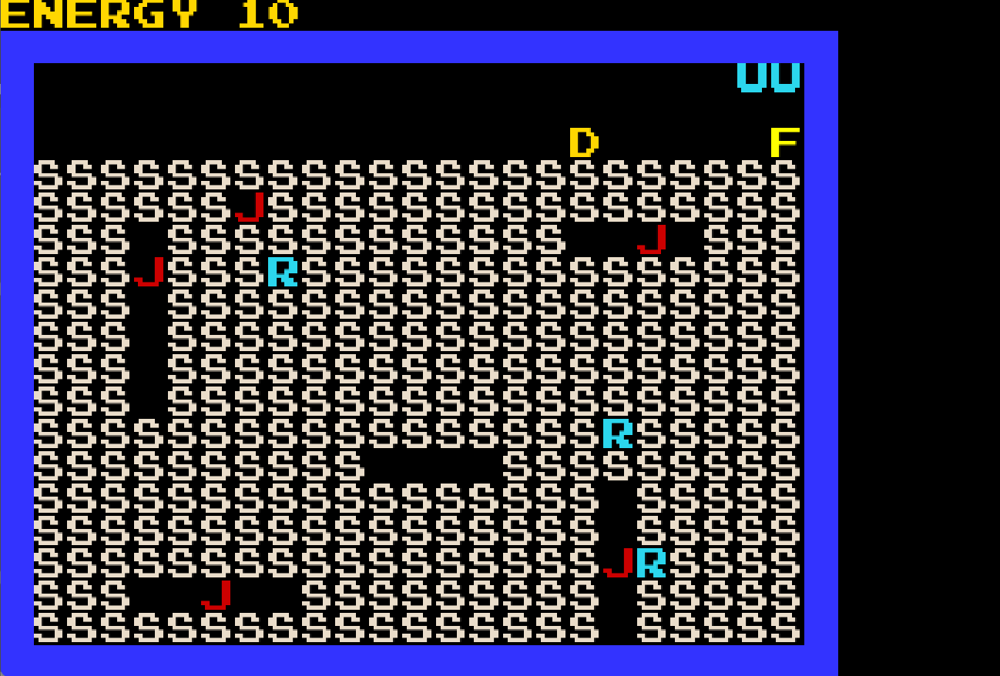
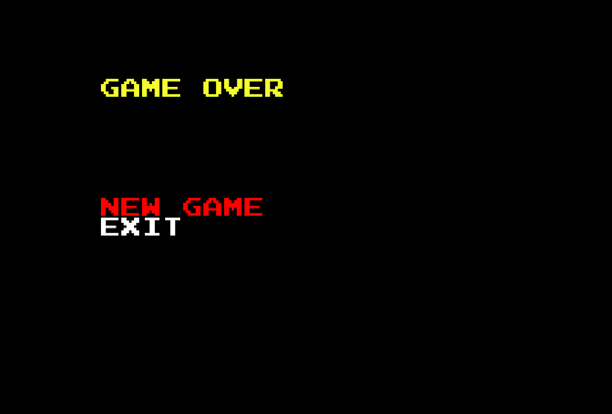

# LDTS_T11_G02 - DIGDUG

## Game Description

Dig Dug is a maze video game. The player controls protagonist Dig Dug (Taizo Hori) to eliminate each screen's enemies: Pookas, red creatures with comically large goggles, and Fygars, fire-breathing green dragons. Dig Dug can use an air pump to inflate them to bursting, or crush them under large falling rocks.

This project was developed by Francisco Dias Pires Ferreira De Sousa (up202108715@fe.up.pt), Ana Carolina Ribeirinho Soares Almeida (uo202108757@fe.up.pt) and Diogo Fernando Pinheiro de Sousa (up202103341@fe.up.pt) for LDTS 2022⁄23.

For a more detailed version of this description click [here](./docs/README.md).

## Screenshots

The following screenshots ilustrate the general look of our game, as well as the divergent functionalities:
### Game preview

  

  <b><i>Gif 1. Sneak peak into DIGDUG game</i></b>

 
 

### Menus

  

  <b><i>Fig 1. Main Menu </i></b>

  

 
 

  

  <b><i>Fig 2. Instructions Menu </i></b>  

  

 
 

### Levels

  

  <b><i>Fig 3. Level 1 </i></b>

 
 

### Animations

  

  <b><i>Gif 2. Rock falling</i></b>

 
 

  

  <b><i>Gif 3. Rock killing monster</i></b>

 
 

### End Game

  

  <b><i>Fig 4. Lost message</i></b>

