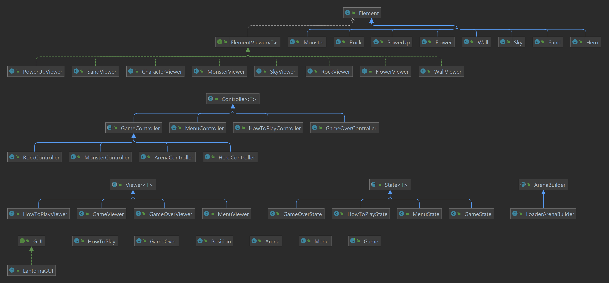
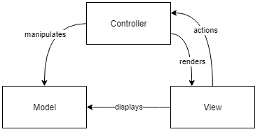
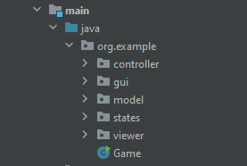
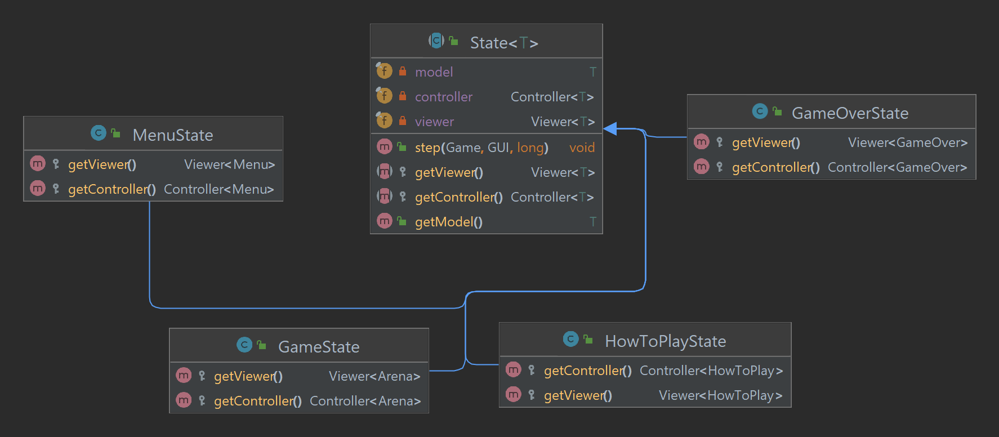
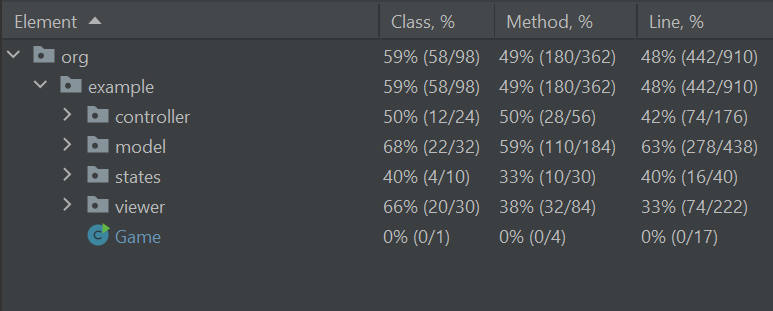

## LDTS_T11_G02 - DIGDUG

Dig Dug is a maze video game. The player controls protagonist Dig Dug (Taizo Hori) to eliminate each screen's enemies: Pookas, red creatures with comically large goggles, and Fygars, fire-breathing green dragons. Dig Dug can use an air pump to inflate them to bursting, or crush them under large falling rocks.
    
This project was developed by *Francisco Dias Pires Ferreira De Sousa* (up202108715@fe.up.pt), *Ana Carolina Ribeirinho Soares Almeida* (uo202108757@fe.up.pt) and *Diogo Fernando Pinheiro de Sousa* (up202103341@fe.up.pt)  for LDTS 2022⁄23.

### PLANNED FEATURES

- **Digging** - The game character will dig the sand when he moves.
- **Air pump** - When the user presses space bar the character will pull out an air pump and shoot it forwards. If the pump connects to an enemy, after some time he will explode.
- **Rock** - Rocks will spawn randomly when the arena is built. If the player digs below them, they will fall until they reach sand again. In the way down, if it hits an entity it will kill them.
- **Power Up** - Power ups have a chance of spawning randomly in some levels, these will speed up the player, reduce kill time, slow down enemies, etc..
- **Flowers** - When a player succeeds a level a small flower is spawned, when there are 10 small flowers the player wins the game and a message is displayed congratulating the player.
    

## DESIGN

### Code Structure

---

### MVC Architectural Pattern

### Problem in Context

While initially working on the project, we were finding ourselves struggling to effectively work simultaneously. On top of that, the complexity level was also rising and making our efforts less productive.

### The Pattern

The **Model View Controller (MVC)** architectural pattern specifies that an application consist of a data model,  presentation information and controli nformation. The pattern requires that each of these be separated into different objects.

### Implementation

As you can see bellow, the UML represents the different category of files and how they interact. On the right side lies our implementation of the pattern.

|                                                                                                              UML                                                                                                               |                                          File System                                          |
|:------------------------------------------------------------------------------------------------------------------------------------------------------------------------------------------------------------------------------:|:---------------------------------------------------------------------------------------------:|
| |  |

### Consequences

The use of the MVC arquitectural pattern in the current design has the following consequences:

- **Easier planning** by giving us an outline of how to arrange their ideas into actual code and easier maintenance by limiting code duplication
- **Easier modification** of the entire application as any changes in a certain section will never affect the entire architecture
- Allows for **easier collaboration** between the team members
- **Supports and encourages TTD** (test-driven development)
- Required us to sometimes split what was previously **one class's functionality into 3 separate classes**, introducing dozens of classes and therefore some complexion
- Required a **heavy refactoring** of all the project's code

---

### State Design Pattern

### Problem in Context

In our game, we use the state design pattern for the menus and for managing game state, allowing for different functionality. Instead of hard coding the diferent visual, logics and duplicating the methods for each class we decided to use the State design pattern.

### The Pattern

State design pattern is used when an object changes its behavior based on its internal state.

If we have to change behavior of an object based on its state, we can have a state variable in the object and use if-else condition block to perform different actions based on the state or introduce different controller classes. State pattern is used to provide a systematic and lose-coupled way to achieve this through context and state implementations.

### Implementation

The following UML representation shows how the different classes connect themselves. In our implementation we used state for 2 different classes, Game and Menu. The Game class holds a state that can either be filled by a GameState or a GameOverState object, while the Menu object's state can be filled by GameOver, HowToPlay or Menu objects.

### Consequences

The use of the State Pattern in the current design has the following consequences:

- Decluttering of the Game class - extracts all state-specific code into a set of distinct classes
- Implementation implicit code - The structure of the pattern is implicit in the filesystem, allowing for a better understanding of all of it's functionality

---

### Decorator Design Pattern

### Problem in Context

In order to implement the MVC pattern we separated the model and the controller. By mapping, for example, the arena to the heroController we can modify the arena externally and essentialy add functionality.

### The Pattern

Decorator pattern allows a user to add new functionality to an existing object without altering its structure. This type of design pattern comes under structural pattern as this pattern acts as a wrapper to existing class.

This pattern creates a decorator class which wraps the original class and provides additional functionality keeping class methods signature intact.

### Implementation

We implemented the controller for several classes, an example is the hero class:

### Consequences

- High degree of **flexibility**
- Expansion of function of classes without inheritance
- **Readable** program code
- Not beginner-friendly
- **High number of objects**

---

### KNOWN CODE SMELLS AND REFACTORING SUGGESTIONS

#### Long Method

The `LanternaGUI` class is a **Long Method**, as it contains more than ten lines used by if statments. This is problematic because not only does it decrease performance but it turn the program less readable.

A way to improve the code would be to use guard clauses. A guard clause is an if statement that checks for a condition and favors early exit from the current method. If the condition is satisfied, the if block returns from the method.

#### Speculative Generality

The `Arena` class is a **Speculative Generality**, as it contains a method `isRockEmptyBelow` that is no longer used. This is problematic because not only does it decrease performance but it adds complexity to our program.

A way to improve the code would be to remove or use this method.

#### Large Class

The `Arena` class is a **Large Class**, as contains many fields/methods/lines of code. This is problematic because it becomes really confusing to work in a giant class.

A way to improve the code would be to extract class if part of the behavior of the large class can be spun off into a separate component.

---
### TESTING

[Mutation Testing Report](pitest/202212231611/index.html)

### SELF-EVALUATION

- Francisco Sousa: 52,5%
- Diogo Sousa: 42,5%
- Ana Carolina: 5%
